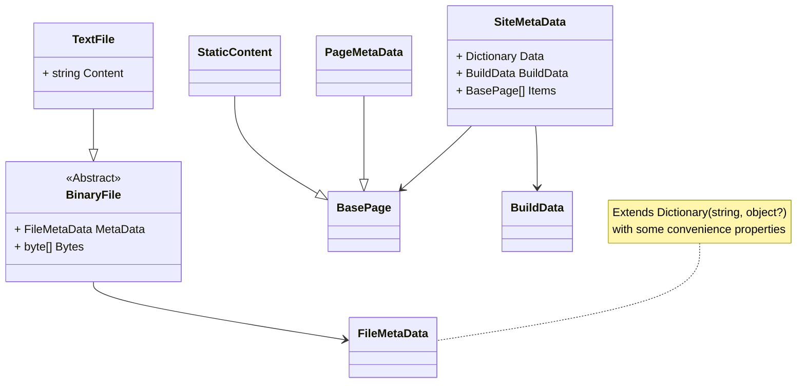

# Kaylumah.GitHub.io

<p align="center">
  
</p>

[](https://github.com/kaylumah/hosting/actions/workflows/azure-static-web-apps-green-field-0353fee03.yml)

---

## Description

This repository is the home for all content of kaylumah.nl. Here, you can find the source code used to generate pages and all my blog posts.

This GitHub project board tracks the status of any planned changes and articles to my website.

## Powered by

| Icon | Name | Description |
| - | - | - |
|  | Scriban | Template engine|
|  | Markdig | Blogs are written in Markdown and converted to HTML |


## Documentation



## Run Locally

For local testing we emulate the Static WebApp via [Static Web Apps CLI](https://azure.github.io/static-web-apps-cli/docs/cli/swa-start/) ; the dependency gets installed by running `npm i` in the root directory of this repository.

### HTTP

```sh
npm start
```

### HTTPS

For a local SSL certificate we use [mkcert](https://github.com/FiloSottile/mkcert)
```sh
# Install if not installed
brew install mkcert      # macOS
choco install mkcert     # Windows
sudo apt install mkcert  # Linux

# Install the local CA:
mkcert -install

# Generate the certificate
mkcert localhost 127.0.0.1 local.kaylumah.nl
```

Ensure `/etc/hosts/` has the following line `127.0.0.1 local.kaylumah.nl`

```sh
npm start:ssl
```

## License

This repo (including Blog content) is licensed under the [MIT License](LICENSE)

<!-- https://giscus.app -->
<!-- https://github.com/giscus/giscus/blob/main/ADVANCED-USAGE.md -->

<!--
Brand Color
green: '#4cae50',
purple: '#55557b'
-->