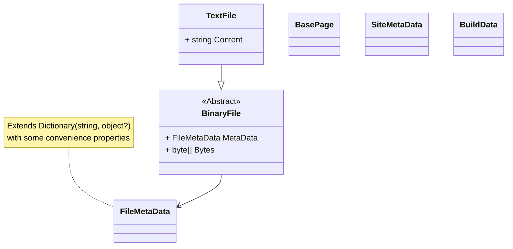

# Structure

```mermaid
classDiagram

    class BinaryFile{
        + FileMetaData MetaData
        + byte[] Bytes
    }
    <<Abstract>> BinaryFile

    class TextFile{
        + string Content
    }

    class FileMetaData{
    }

    BinaryFile --> FileMetaData
    TextFile --|> BinaryFile

    class BasePage {
    }

    class SiteMetaData {
    }

    class BuildData {
    }

    note for FileMetaData "Extends Dictionary(string, object?) 
    with some convenience properties"
```